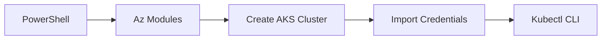

# Managing Azure Kubernetes Service (AKS) Using PowerShell

## 1. Overview
PowerShell provides automation for Azure, including AKS. You can:
- Log in to Azure
- Set subscription
- Install AKS modules
- Create AKS clusters
- Import credentials
- Configure autocompletion and aliases

## 2. Why This Concept Exists
PowerShell enables automation, repeatability, and integration with CI/CD workflows.

## 3. Key Terminology
**Az Module** – Azure PowerShell module.
**Az.Aks** – Module for AKS resources.
**Subscription** – Logical Azure resource container.
**PowerShell Profile** – Script executed on every shell start.
**Import-AzAksCredential** – Retrieves kubeconfig.

## 4. How It Works
### A. Login
```
Connect-AzAccount
```
### B. Set Subscription
```
Set-AzContext -Subscription "SUBSCRIPTION_ID"
```
### C. Create Resource Group
```
New-AzResourceGroup -Name myRG -Location eastus
```
### D. Create AKS Cluster
```
New-AzAksCluster -ResourceGroupName myRG -Name myAKSCluster -NodeCount 2 -GenerateSshKey
```
### E. Fix SSH Directory Bug
```
New-Item -ItemType Directory -Path "$HOME/.ssh"
```
### F. Import Credentials
```
Import-AzAksCredential -ResourceGroupName myRG -Name myAKSCluster
```
### G. Autocompletion
```
kubectl completion powershell | Out-String | Invoke-Expression
```
Make persistent via profile:
```
notepad $PROFILE
```
Add:
```
Set-Alias k kubectl
function kn { kubectl config set-context --current --namespace $args }
```
Reload:
```
.& $PROFILE
```

## 5. Real-World Analogy
PowerShell profile = your personalized workstation.

## 6. Diagram


## 7. Common Mistakes
- Forgetting SSH directory
- Not reloading `$PROFILE`
- Wrong subscription ID

## 8. Interview Tips
- Be ready to explain `$PROFILE`.
- Know how to create AKS cluster.

## 9. Quick Revision
- Connect → Set Context → Create RG → Create AKS → Import Credentials
