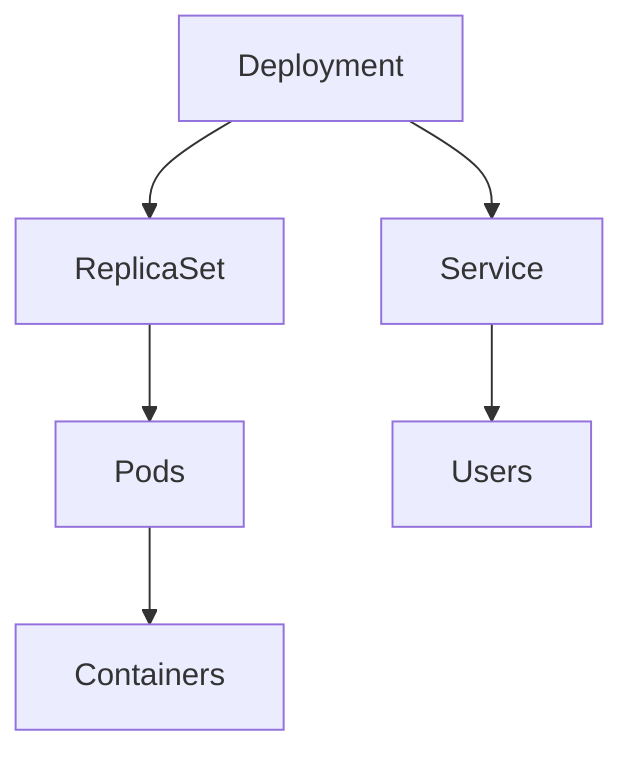

# Core Kubernetes Objects Explained

## 1. Overview
Kubernetes uses various objects to manage workloads, networking, and configuration.
This document explains:
- Nodes
- Pods
- Deployments
- ReplicaSets
- DaemonSets
- Services
- Secrets
- ConfigMaps
- Namespaces

## 2. Why These Objects Exist
Kubernetes needs structures to manage:
- Workload placement
- Scaling
- Updates
- Networking
- Sensitive data
- Environment configuration

Each object solves a specific challenge.

## 3. Key Terminology
### Node
Worker machine (VM or physical).

### Pod
Smallest deployable unit; runs one or more containers.

### ReplicaSet
Ensures the right number of pod replicas.

### Deployment
Controls ReplicaSets and rollout strategies.

### DaemonSet
Ensures one pod runs on every node.

### Service
Provides stable networking to pods.

### Secret
Stores sensitive data encoded in base64.

### ConfigMap
Stores non-sensitive config data.

### Namespace
Logical grouping of Kubernetes resources.

## 4. How It Works
### A. Pods
```
kubectl run nginx --image=nginx
```

### B. ReplicaSet
Automatically created by Deployment.

### C. Deployment
```
kubectl create deployment web --image=nginx --replicas=2
```

### D. DaemonSet
```
kubectl get ds -A
```

### E. Services
Types:
- ClusterIP
- NodePort
- LoadBalancer

### F. Secrets & ConfigMaps
Used for dynamic configuration.

### G. Namespaces
```
kubectl get ns
```

## 5. Diagram


## 6. Common Mistakes
- Tabs in YAML
- Confusing Deployment vs ReplicaSet
- Forgetting Service types

## 7. Interview Tips
Common questions:
- What is the difference between Pod and Deployment?
- When do you use a DaemonSet?
- Secret vs ConfigMap?

## 8. Quick Revision
- Pod = container(s)
- Deployment = manages pods
- Service = networking abstraction
- Namespace = isolation layer
