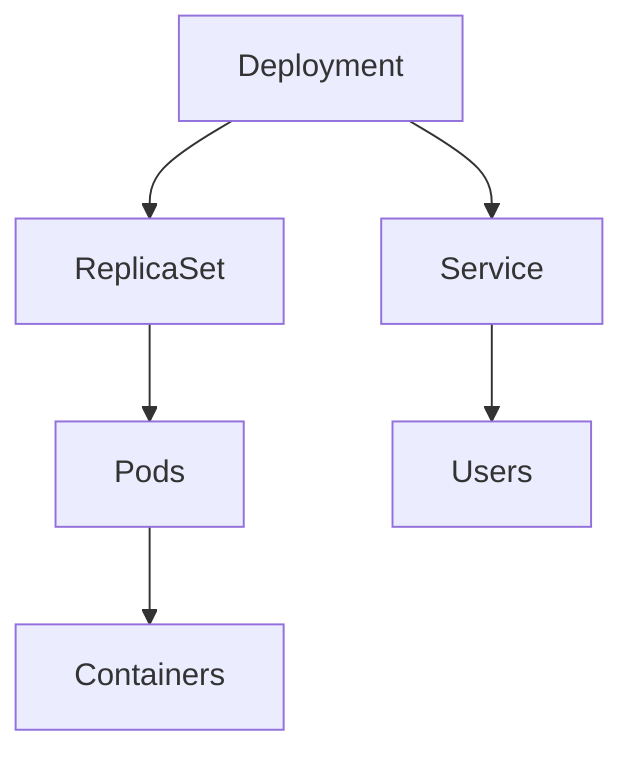

# Core Kubernetes Objects Explained

## 1. Overview
Kubernetes contains several core objects that work together to run applications:
- Pods
- Deployments
- ReplicaSets
- DaemonSets
- Services
- Secrets
- ConfigMaps
- Namespaces

## 2. Why These Objects Exist
They help Kubernetes manage:
- Workload placement
- Scaling
- Configuration
- Networking
- Security

## 3. Key Terminology
**Node** – Worker machine.
**Pod** – Smallest deployable unit.
**ReplicaSet** – Ensures replica count.
**Deployment** – Manages ReplicaSets.
**DaemonSet** – Runs one pod per node.
**Service** – Stable networking.
**Secret** – Encoded sensitive data.
**ConfigMap** – Plain text config.
**Namespace** – Logical grouping.

## 4. How It Works
### A. Pods
```
kubectl run nginx --image=nginx
```
### B. ReplicaSet
Automatically created by Deployments.
### C. Deployment
```
kubectl create deployment web --image=nginx --replicas=2
```
### D. DaemonSet
```
kubectl get ds -A
```
### E. Services
ClusterIP, NodePort, LoadBalancer.
### F. Secrets & ConfigMaps
Used for app configuration.
### G. Namespaces
```
kubectl get ns
```

## 5. Diagram


## 6. Common Mistakes
- Mixing tabs/spaces in YAML
- Confusing Deployments vs ReplicaSets

## 7. Interview Tips
Expect questions:
- Difference between Pod & Deployment?
- What is a DaemonSet?
- Secret vs ConfigMap

## 8. Quick Revision
- Pod → container
- Deployment → manages Pods
- Service → networking
- Namespace → isolation
