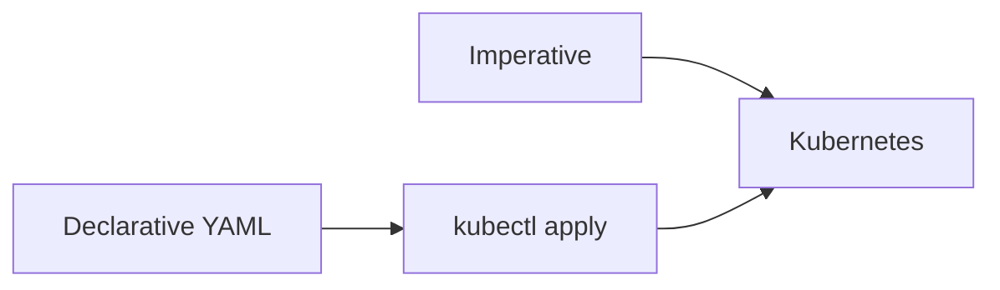

# Imperative vs Declarative Kubernetes Resource Management

## 1. Overview
Kubernetes resources can be created and managed two ways:
- Imperative: direct commands
- Declarative: YAML defining desired state

## 2. Why This Concept Exists
Declarative configs improve:
- Reproducibility
- Version control
- Automation

Imperative commands help with:
- Quick tests
- Debugging

## 3. Key Terminology
**Imperative Command** – Direct instructions.
**Declarative Manifest** – YAML describing desired state.
**kubectl apply** – Reconciles desired vs current state.
**Dry Run** – Generates YAML without creating resources.

## 4. How It Works
### A. Imperative Example
```
kubectl create deployment nginx --image=nginx --replicas=2
```
### B. Declarative Example
```
kubectl apply -f nginx.yaml
```
### C. Dry Run
```
kubectl create deployment nginx --image=nginx --replicas=2 --dry-run=client -o yaml
```

## 5. Real World Analogy
- Imperative = giving step-by-step cooking instructions
- Declarative = describing the final dish you want

## 6. Diagram


## 7. Common Mistakes
- Mixing imperative & declarative on same resource
- Not storing YAML in version control

## 8. Interview Tips
Expect:
- Which method is preferred and why?
- What is a dry run?

## 9. Quick Revision
- Imperative = quick
- Declarative = production-ready
- Dry run = generate YAML
