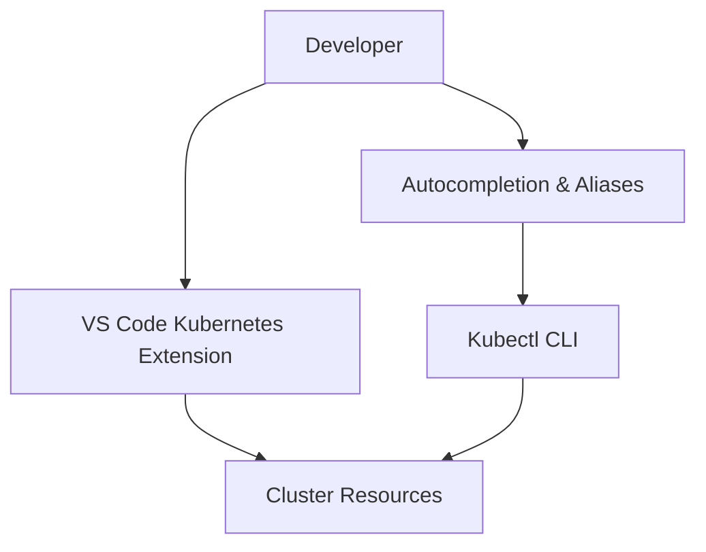

# Improving Kubernetes Productivity: Autocompletion, Aliases & VS Code Extensions

## 1. Overview
Working with Kubernetes requires frequent use of `kubectl`, which can become repetitive and slow. Productivity improves dramatically when we add:
- Autocompletion for commands, resources, and arguments
- Aliases to shorten long commands
- VS Code extensions to visually explore clusters
- Keyboard shortcuts to run commands quickly

These tools make Kubernetes smoother, faster, and more intuitive.

## 2. Why This Concept Exists
Kubernetes commands are long and require constant typing. Examples:
```
kubectl get pods -n kube-system
kubectl describe deployment <name>
kubectl apply -f <file>
```
This leads to mistakes and slower workflows. Autocompletion, aliases, and tooling improve efficiency.

## 3. Key Terminology
**Autocompletion** – Helps complete commands when pressing Tab.
**Alias** – Shorthand for long commands.
**VS Code Kubernetes Extension** – GUI to explore clusters.
**Azure Kubernetes Service Extension** – Azure-focused Kubernetes management.
**Keyboard Shortcut Execution** – Executes selected text in integrated terminal.

## 4. How It Works
### A. Bash Autocompletion
```
source <(kubectl completion bash)
```
Make persistent:
```
echo "source <(kubectl completion bash)" >> ~/.bashrc
```
Aliases:
```
alias k=kubectl
complete -F __start_kubectl k
alias kn='kubectl config set-context --current --namespace'
```
Reload:
```
source ~/.bashrc
```

### B. VS Code Extensions
Enables:
- Browsing namespaces, pods, deployments
- Auto‑generating YAML
- Applying YAML to cluster

### C. Keyboard Shortcut
1. Ctrl+Shift+P → Preferences → Keyboard Shortcuts
2. Search: *Run Selected Text*
3. Assign: `Ctrl+R`

## 5. Real World Analogy
- Autocompletion = Google search suggestions
- Aliases = Speed dial
- Kubernetes extension = File explorer
- Shortcut execution = Hotkey for quick actions

## 6. Examples
```
k get p <TAB>
kn kube-system
```

## 7. Diagram


## 8. Common Mistakes
- Forgetting to reload `.bashrc`
- Using Tab before configuring autocompletion
- Tabs in YAML instead of spaces

## 9. Interview Tips
Be ready to answer:
- How to enable autocompletion?
- Common aliases?
- How to use VS Code extensions?

## 10. Quick Revision
- `k` = `kubectl`
- Autocompletion saves time
- VS Code simplifies cluster exploration
- Keyboard shortcuts improve speed
